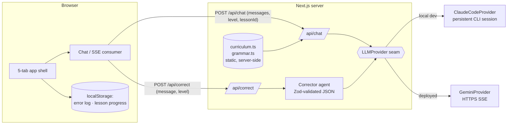

# Deutsch-Tutor

An AI German tutor that **remembers every mistake you make and builds your curriculum out of them**.

Duolingo teaches everyone the same German; ChatGPT forgets your mistakes. This app logs every error you make in real conversation, turns them into drills, and tells you what to practice next.

**Live:** [german-tutor-weld.vercel.app](https://german-tutor-weld.vercel.app) · **Stack:** Next.js (App Router) · TypeScript · Tailwind · SSE streaming · Zod

## What it does

| Tab | Feature |
|---|---|
| **Learn** | 32 guided CEFR lessons (A1→B2). Each lesson steers a live conversation — the tutor gets a hidden topic + grammar focus and takes the lead. |
| **Chat** | Streaming German conversation adapted to your level (A1–B2). At A1 the tutor glosses new words in English and accepts English input. Errors are *recast* naturally, never lectured. |
| **Practice** | Drills built from **your own past mistakes**: rewrite your wrong sentences; deterministic checking against the stored correction — zero LLM cost. |
| **Progress** | A rule-based recommender ("Practice today") ranks your error types by frequency × recency-decay (7-day half-life) and picks your focus. Stats, per-type breakdown, 14-day activity strip. |
| **Grammar** | A 40-rule visual reference (A1→B2): typographic glyph cards ("der die das", "V2", "…, weil"), English explanations, correct declension tables — and every rule launches a focused practice conversation. |

## Architecture



Design decisions worth reading the code for:

- **The provider seam** (`lib/llm/provider.ts`): every model call goes through one `streamChat` interface. Local dev spawns the Claude Code CLI; the deployment streams from Groq (gpt-oss-120b) over HTTPS, with a Gemini provider as an alternative. Swapping providers is one env var.
- **Persistent CLI session** (`lib/llm/claude-code.ts`): instead of paying ~2 s of CLI bootstrap per message, one long-lived process serves the whole conversation over `stream-json` stdin/stdout. Warm-turn time-to-first-token: **under 1 second**. The file documents every Windows/CLI trap found on the way.
- **Two agents per turn, never blocking**: the conversation reply streams immediately; a parallel Corrector (stronger model — wrong grammar explanations are poison) annotates the message 1–2 s later with exact-substring error spans.
- **The recommender is a formula, not an LLM**: `weight = e^(-age_days / 7)` summed per error type. Explainable, free, and testable.
- **Lesson prompts never cross the wire**: the client sends a lesson *id*; the German steering instruction is resolved server-side.

## Run it locally

```bash
npm install
npm run dev            # needs the claude CLI authenticated (local provider)
# or with Gemini:
LLM_PROVIDER=gemini GEMINI_API_KEY=... npm run dev
npm run test:llm       # two-turn streaming smoke test with TTFT measurement
```

## Roadmap

Persistence (Postgres/Drizzle + NextAuth), per-correction error records, SM-2 spaced repetition, Langfuse tracing per agent — see `CLAUDE.md` for the slice plan.
